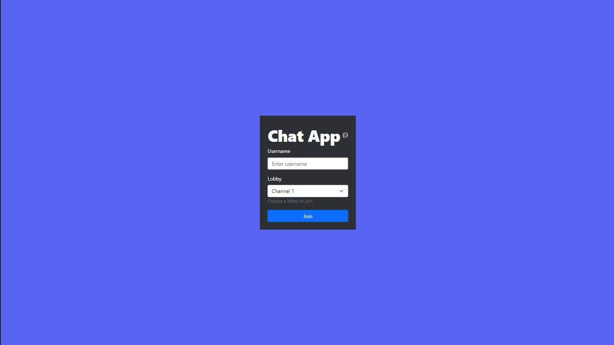
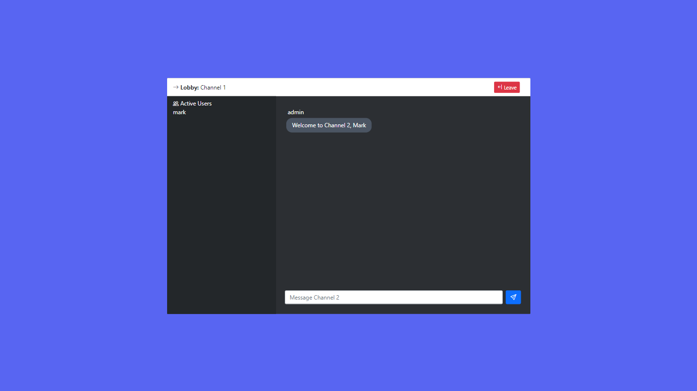
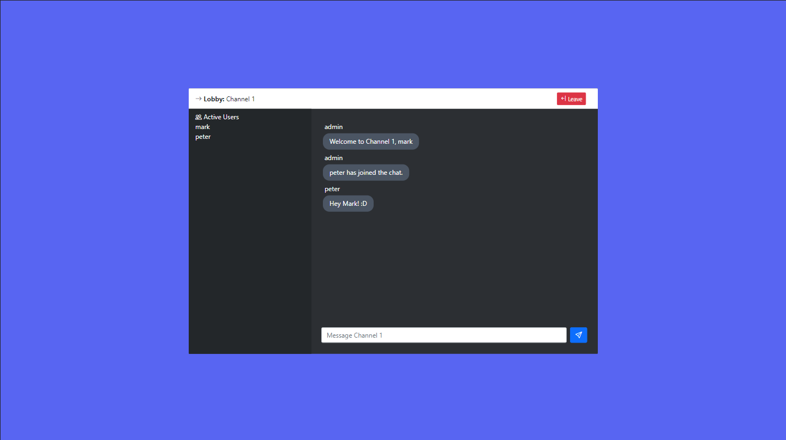

# ChatApp

## Overview
ChatApp is a full stack application developed using React, Bootstrap, and Tailwind that allows users to log‑in/sign‑up, upload, visit existing profiles, and edit personal profile for social networking. It's back-end uses Express and SocketIO for integration of WebSockets and endpoints.

## How to Run
 1. Clone `chat-app` repository using `git clone https://github.com/markacruz/chat-app.git`
 2. Install dependencies for both `client` and `server` using `npm install`
 3. Run both folders:
	- For `client`, use `npm start`
	- For `server`, use `npm run dev` 
 4. Use the application!

## Images
### 1. Landing Page

### 2. Lobby

### 3. Lobby with new joined user

